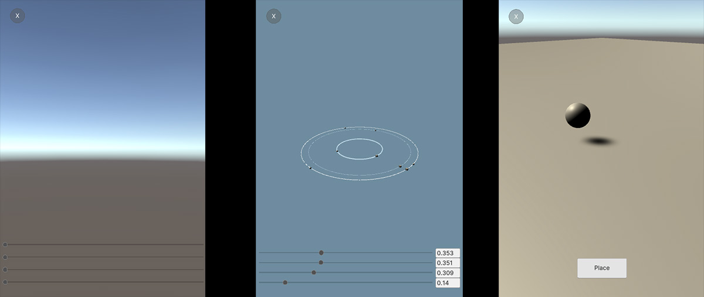

# StarSystemSynthesizer
 
 
 
This is a project to learn to use the new UI Toolkit to build an editor and runtime UI for an experimental synth/step sequencer. Note, there is no audio in this project, just the two UI systems and scripts to create orbiting object and cubes that serve as note-making collisions.
 
Documentation for the UI Toolkit is sparse and the [Unity Royale Demo](https://github.com/Unity-Technologies/UIToolkitUnityRoyaleRuntimeDemo)
is so complex it's hard to figure out how to implement a simple button or slider.

There are 3 scenes to demonstrate various UI use cases using UI Toolkit and UI Builder.

## Sliders
This is just runtime sliders. Nothing is hooked up to them

## Solar System
While looking for examples, I was very fortunate to find [this blog post](https://a2i2.deakin.edu.au/2020/04/03/creating-a-uielements-custom-inspector-in-unity/) not only describing how to make an interface, it was making a solar system-type interface as well! Super helpful and also allowed me to get into making scriptable objects for the first time.

It's a complex scene - select the Star System scriptable object (SO) in the editor. This allows you to add orbits and planets to the orbit. The orbit is a LineRenderer that makes a circle at a desired resolution. My idea was the planets on the orbit hit a stationary waypoint that triggers a note. Orbits can have multiple waypoints (notes) and multiple planets. By varying the speed of the planet, you can create a sort of step synthesizer.

The SO allows one to build an asset outside of a scene. To actually visualize the system, click the "Update" button on the system that is part of the Scene. 

## Place on Plane
One would think placing an object on a plane in AR would be long solved, but I found the examples all had the problem of hitting a 'Done' button would cause the object to move to be under the button. There was no easy way to ignore raycasts on a plane under a button. I followed the [discussion](ttps://forum.unity.com/threads/is-there-a-way-to-block-raycasts.943963/#post-6188745) advice here and made a large element to block the entire screen. On top of that screen is a button. A touch returns true when over the screen and allows the placed object to be moved. When the touch is over the button, movement is not allowed.

This scene is not using the ARFoundation, but the logic is transferrable to the Input_PlaceOnPlane example in the ARFoundation. Just use the ARRaycastManager instead of the Physics Raycaster.

